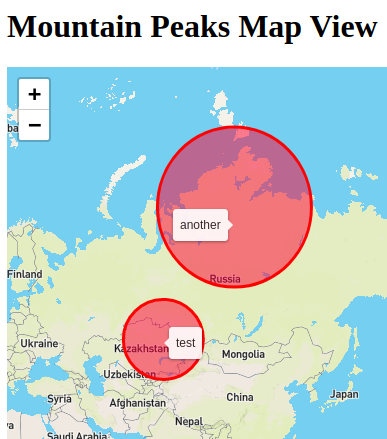

mountain-peaks
==============



Environment
-----------

- Linux Mint 20.1
- python 3.8.5
- pipenv 11.9.0
- PostgreSQL 12.6
- docker 20.10.2
    ```
    sudo usermod -a -G docker myuser
    ```
- docker-compose 1.29.1

Setup
-----

1. Create a PostgreSQL access:
    - Database: `luc`
    - User: `luc`
    - Password: `luc`
2. Create a Python virtual environment and install dependencies:
    ```
    $ cd web-service
    $ pipenv install
    ```
3. Create database:
    ```
    $ cd mysite
    $ pipenv run python manage.py migrate
    ```
4. Run web application:
    ```
    $ pipenv run python manage.py runserver
    ```
5. Open <http://localhost:8000/> with a web browser.

Run with docker
---------------

1. Start containers:
    ```
    $ cd docker
    $ docker-compose up
    ```
2. Open <http://localhost:8000/> with a web browser.

TODO
----

- Create API docs with Swagger
- Use uWSGI or Gunicorn instead of Python container
- Remove test credentials and secret key from settings
